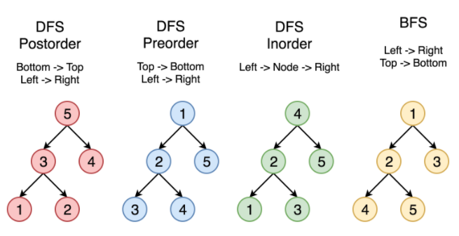

# Data Structues

In this folder, we will discuss some important DSs and the declaration on different programming lanuage. The outline inspired from the book [Cracking the Code Interview](http://www.crackingthecodinginterview.com) and [qiyuangong's leetcode](https://github.com/qiyuangong/leetcode).

## Array and List

An array is a collection of items stored at contiguous memory locations. The idea is to store multiple items of the same type together. When we declare an array in program, the memory assign a fixed size of space for the array. A list is an object which holds variables in a specific order.

### Leetcode Problems

Clone the problem list [here](https://leetcode.com/list/x8iyupb5)

|  #   | Title                                                                                             | Difficulty |                                     Solution                                     | Follow-up         |
| :--: | :------------------------------------------------------------------------------------------------ | :--------: | :------------------------------------------------------------------------------: | :---------------- |
| 896  | [Monotonic Array](https://leetcode.com/problems/monotonic-array/)                                 |   `Easy`   |    [Python](./python/monotonic_array.py), [Java](./java/MonotonicArray.java)     |                   |
| 766  | [Toeplitz Matrix](https://leetcode.com/problems/toeplitz-matrix/)                                 |   `Easy`   |    [Python](./python/toeplitz_matrix.py), [Java](./java/ToeplitzMatrix.java)     | 1329,             |
| 1346 | [Check If N and Its Double Exist](https://leetcode.com/problems/check-if-n-and-its-double-exist/) |   `Easy`   |       [Python](./python/check_double.py), [Java](./java/CheckDouble.java)        |                   |
| 238  | [Product of Array Except Self](https://leetcode.com/problems/product-of-array-except-self/)       |  `Medium`  | [Python](./python/prodcut_except_self.py), [Java](./java/ProductExceptSelf.java) |                   |
|  1   | [Two Sum](https://leetcode.com/problems/two-sum/)                                                 |   `Easy`   |            [Python](./python/two_sum.py), [Java](./java/TwoSum.java)             | 1099, 560         |
|  55  | [Jump Game](https://leetcode.com/problems/jump-game/)                                             |  `Medium`  |          [Python](./python/jump_game.py), [Java](./java/JumpGame.java)           | 45, 1306          |
|  45  | [Jump Game II](https://leetcode.com/problems/jump-game-ii/)                                       |   `Hard`   |        [Python](./python/jump_game_ii.py), [Java](./java/JumpGameII.java)        | 1306,             |
|  56  | [Merge Intervals](https://leetcode.com/problems/merge-intervals/)                                 |  `Medium`  |    [Python](./python/merge_intervals.py), [Java](./java/MergeIntervals.java)     | 57, 252, 759, 986 |
| 252  | [Meeting Rooms](https://leetcode.com/problems/meeting-rooms/)                                     |   `Easy`   |       [Python](./python/meeting_room.py), [Java](./java/MeetingRooms.java)       | 253,              |
| 253  | [Meeting Rooms II](https://leetcode.com/problems/meeting-rooms-ii/)                               |   `Easy`   |    [Python](./python/meeting_room_ii.py), [Java](./java/MeetingRoomsII.java)     |                   |
| 152  | [Maximum Product Subarray](https://leetcode.com/problems/maximum-product-subarray/)               |  `Medium`  |     [Python](./python/max_prod_subarr.py),[Java](./java/MaxProdSubArr.java)      | 238, 713          |
|  54  | [Spiral Matrix](https://leetcode.com/problems/spiral-matrix/)                                     |  `Medium`  |      [Python](./python/spiral_matrix.py), [Java](./java/SpiralMatrix.java)       | 59                |
| 1366 | [Rank Teams by Votes](https://leetcode.com/problems/rank-teams-by-votes/)                         |  `Medium`  |         [Python](./python/rank_teams.py), [Java](./java/RankTeams.java)          |                   |
|  15  | [3 Sum](https://leetcode.com/problems/3sum/)                                                      |  `Medium`  |          [Python](./python/three_sum.py), [Java](./java/ThreeSum.java)           | 16, 18, 253       |
|  16  | [3Sum Closest](https://leetcode.com/problems/3sum-closest/)                                       |  `Medium`  |   [Python](./python/three_sum_closest.py), [Java](./java/ThreeSumClosest.java)   | 15, 18, 253       |
| 560  | [Subarray Sum Equals K](https://leetcode.com/problems/subarray-sum-equals-k/)                     |  `Medium`  |  [Python](./python/subarray_sum_equal.py), [Java](./java/SubarraySumEqual.java)  | 713,              |
| 128  | [Longest Consecutive Sequence](https://leetcode.com/problems/longest-consecutive-sequence/)       |   `Hard`   |                [Python](./python/lcs.py), [Java](./java/LCS.java)                |                   |
| 1057 | [Campus Bikes](https://leetcode.com/problems/campus-bikes/)                                       |  `Medium`  |                        [Python](./python/campus_bikes.py)                        |                   |

## Characters and String

A string is a data type used in programming, it is comprised of a set of characters that can also contain spaces and numbers. String is immutable in most cases.

### String vs String Buffer vs String Builder

This is a popular interview question in **Java**.

|  Parameter  |               String               |                  String Buffer                   |            String Builder             |
| :---------: | :--------------------------------: | :----------------------------------------------: | :-----------------------------------: |
|   Storage   |            String Pool             |                       Heap                       |                 Heap                  |
| Mutability  |             Immutable              |                     Mutable                      |                Mutable                |
| Thread Safe | Not used in a threaded environment |       Used in a multi-threaded environment       | Used in a single-threaded environment |
| Performance |                Slow                | Slower than StringBuilder but faster than String |       Faster than StringBuffer        |

### Leetcode Problems

Clone the problem list [here](https://leetcode.com/list/xicddurd)

|  #  | Problem                                                                                                 | Difficulty |                                   Solution                                   | Follow-up |
| :-: | :------------------------------------------------------------------------------------------------------ | :--------: | :--------------------------------------------------------------------------: | :-------- |
| 125 | [Valid Palindrome](https://leetcode.com/problems/valid-palindrome/)                                     |   `Easy`   | [Python](./python/valid_palindrome.py), [Java](./java/ValidPalindrome.java)  | 680       |
| 387 | [First Unique Character in a String](https://leetcode.com/problems/first-unique-character-in-a-string/) |   `Easy`   | [Python](./python/first_unique_char.py), [Java](./java/FirstUniqueChar.java) | 451,      |
| 451 | [Sort Characters By Frequency](https://leetcode.com/problems/sort-characters-by-frequency/)             |  `Medium`  | [Python](./python/sort_char_by_freq.py), [Java](./java/SortCharByFreq.java)  |           |

## LinkedList

### Leetcode Problems

Clone the problem list [here](https://leetcode.com/list/xij041s6)

|  #   | Title                                                                                                                                   | Difficulty |                                 Solution                                 | Follow-up |
| :--: | :-------------------------------------------------------------------------------------------------------------------------------------- | :--------: | :----------------------------------------------------------------------: | :-------- |
|  19  | [Remove Nth Node From End of List](https://leetcode.com/problems/remove-nth-node-from-end-of-list/)                                     |  `Medium`  | [Python](./python/remove_nth_node.py), [Java](./java/RemoveNthNode.java) |           |
| 1171 | [Remove Zero Sum Consecutive Nodes from Linked List](https://leetcode.com/problems/remove-zero-sum-consecutive-nodes-from-linked-list/) |  `Medium`  | [Python](./python/remove_zero_sum.py), [Java](./java/RemoveZeroSum.java) |           |
| 206  | [Reverse Linked List](https://leetcode.com/problems/reverse-linked-list/)                                                               |   `Easy`   |                                                                          | 234       |
| 234  | [Palindrome Linked List](https://leetcode.com/problems/palindrome-linked-list/)                                                         |   `Easy`   |                                                                          |           |

## Stack and Queue

### Leetcode Problems

Clone the problem list [here](https://leetcode.com/list/xicdw3ps)

|  #  | Problem | Difficulty | Solution | Follow-up | Freq. |
| :-: | :------ | :--------: | :------: | :-------- | :---: |
|     |         |            |          |           |       |

## Tree, Trie and Graph

### Tree Traverse



### Algorithms

The followings are some certain algorithm can be used on Tree, Trie, Graph structure.

#### Morris Traversal

Using Morris Traversal on tree structure, we can traverse the tree without using stack and recursion. i.e. The space complexity is O(1).

**Preorder**

```
Step 1: Initialize current as root

Step 2: While current is not NULL,

    If current node have left child
        a. Add the current node and its right subtree (cur and cur.right) to the rightmost node of current left subtree (the rightmost node in cur.left)

        b. Go to this left child, i.e., current = current.left

    Else
        a. Add current’s value

        b. Go to the right, i.e., current = current.right
```

### Leetcode Problems

Clone the problem list [here](https://leetcode.com/list/xicd7w93)

|  #  | Problem                                                                                       | Difficulty |                                     Solution                                     | Follow-up |
| :-: | :-------------------------------------------------------------------------------------------- | :--------: | :------------------------------------------------------------------------------: | :-------- |
| 94  | [Binary Tree Inorder Traversal](https://leetcode.com/problems/binary-tree-inorder-traversal/) |  `Medium`  | [Python](./python/binary_tree_inorder.py), [Java](./java/BinaryTreeInorder.java) | 144, 145  |

## Reference

- [Cracking the Code Interview 6th edition](http://www.crackingthecodinginterview.com)
- [Leetcode](https://leetcode.com/)

## Style Guilde

- [Python Style Guide](http://google.github.io/styleguide/pyguide.html)

- [Java Style Guide](https://github.com/twitter-archive/commons/blob/master/src/java/com/twitter/common/styleguide.md#documentation)
