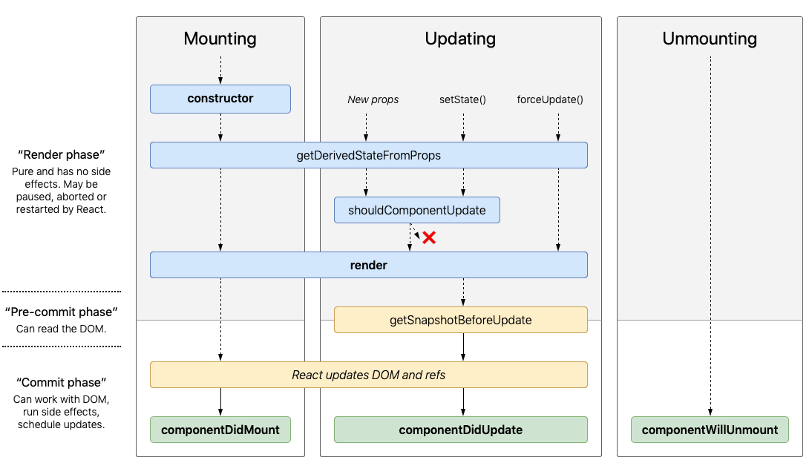

# Interview

Most interviews consist with few stages as follows.

- Introdcution Yourself
- Talk about Experience/Projects on Your Resume
- [Technical Questions](#Technicals)
- Coding Chanllenges
- [Behavioral Questions](#Behavior-Questions)
- [Questions To Ask](#Questions-To-Ask])

## Technicals

[Here](http://interview-questions-247.appspot.com) is a very nice website to take a short quiz to evaluate your understandings of technical knowledge.

List of Technical knowledge:

- [Object-Oriented Programming](#Object-Oriented-Programming)
- [System](#System)
- [Design Patterns](#Design-Patterns)
- [React](#React)
- [Cascading Style Sheets(CSS)](<#Cascading-Style-Sheets(CSS)>)
- [REpresentational State Transfer(REST)](<REpresentational-State-Transfer(REST)>)
- [HTTP Methods](#HTTP-Methods)
- [Node.js](#Node.js)
- [Database](#Database)

### Object-Oriented Programming

Object Oriented Programming (OOP) is a programming paradigm where the complete software operates as a bunch of objects talking to each other. An object is a collection of data and methods that operate on its data.

#### Main Features of OOP

- **Inheritance:** Inheritance is a feature of OOPs which allows classes inherit common properties from other classes. For example, if there is a class such as ‘vehicle’, other classes like ‘car’, ‘bike’, etc can inherit common properties from the vehicle class. This property helps you get rid of redundant code thereby reducing the overall size of the code.

- **Encapsulation:** Encapsulation refers to binding the data and the code that works on that together in a single unit. For example, a class. Encapsulation also allows data-hiding as the data specified in one class is hidden from other classes.

- **Polymorphism:** Polymorphism refers to the ability to exist in multiple forms. Multiple definitions can be given to a single interface. For example, if you have a class named Vehicle, it can have a method named speed but you cannot define it because different vehicles have different speed. This method will be defined in the subclasses with different definitions for different vehicles.

- **Abstraction:** Abstraction is a very important feature of OOPs that allows displaying only the important information and hiding the implementation details. For example, while riding a bike, you know that if you raise the accelerator, the speed will increase, but you don’t know how it actually happens. This is data abstraction as the implementation details are hidden from the rider.

#### Object vs Class

| Object                                                                                      | Class                                                                    |
| :------------------------------------------------------------------------------------------ | :----------------------------------------------------------------------- |
| Object is an **instance** of a class.                                                       | Class is a **blueprint** or **template** from which objects are created. |
| Object is a real world entity such as pen, laptop, mobile, bed, keyboard, mouse, chair etc. | Class is a group of similar objects.                                     |
| Object is a **physical** entity.                                                            | Class is a **logical** entity.                                           |
| Object is created through **new** keyword mainly e.g. Student s1=new Student();             | Class is declared using **class** keyword e.g.class Student{}            |
| Object is created **many times** as per requirement.                                        | Class is declared **once**.                                              |
| Object **allocates memory** when it is created.                                             | Class **doesn't allocated memory** when it is created.                   |

Example:

| Class |              Object              |
| :---: | :------------------------------: |
| Human |            Man, Woman            |
| Fruit | Apple, Banana, Mango, Guava wtc. |
| Food  |      Pizza, Burger, Samosa       |
|  Car  |       Sedan, SUV, Mini Van       |

#### Multiple inheritance vs Multilevel inheritance

| Multiple inheritance                                                                   | Multilevel inheritance                                                                                                  |
| :------------------------------------------------------------------------------------- | :---------------------------------------------------------------------------------------------------------------------- |
| Multiple inheritance comes into picture when a class inherits more than one base class | Multilevel inheritance means a class inherits from another class which itself is a subclass of some other base class    |
| Example: A class defining a child inherits from two base classes Mother and Father     | Example: A class describing a sports car will inherit from a base class Car which inturn inherits another class Vehicle |

#### Overloading vs Overriding

- **Overloading:** Method overloading is a feature of OOPs which makes it possible to give the same name to more than one methods within a class if the arguments passed differ.
- **Overriding:** Method overriding is a feature of OOPs by which the child class or the subclass can redefine methods present in the base class or parent class. Here, the method that is overridden has the same name as well as the signature meaning the arguments passed and the return type.

#### SOLID Principles

### System

#### Memory Model

- int : integer number : 4-bytes
- short : integer number : 2-bytes
- long : integer number : 8-bytes
- char : character : 1-byte
- float : floating point number : 4-bytes
- double : floating point number : 8-bytes

#### Memory Leak

Memory leak is a type of resource leak that occurs when a computer program incorrectly manages memory allocations in such a way that memory which is no longer needed is not released. A memory leak may also happen when an object is stored in memory but cannot be accessed by the running code. This situation mostly occurs in C/C++ program. (Jave has GC to handle the unused reference)

Example:

```
When a button is pressed:
  Get some memory, which will be used to remember the floor number
  Put the floor number into the memory
  Are we already on the target floor?
    If so, we have nothing to do: finished
    Otherwise:
      Wait until the lift is idle
      Go to the required floor
      Release the memory we used to remember the floor number
```

The memory leak would occur if the floor number requested is the same floor that the elevator is on; the condition for releasing the memory would be skipped. Each time this case occurs, more memory is leaked.

Cases like this wouldn't usually have any immediate effects. People do not often press the button for the floor they are already on, and in any case, the elevator might have enough spare memory that this could happen hundreds or thousands of times. However, the elevator will eventually run out of memory. This could take months or years, so it might not be discovered despite thorough testing.

Source: [Wikipedia](https://en.wikipedia.org/wiki/Memory_leak)

### Design Patterns

Design patterns can be classified in three categories: Creational, Structural and Behavioral patterns.

- Creational Patterns: These design patterns provide a way to create objects while hiding the creation logic, rather than instantiating objects directly using new opreator. This gives program more flexibility in deciding which objects need to be created for a given use case.

- Structural Patterns: These design patterns concern class and object composition. Concept of inheritance is used to compose interfaces and define ways to compose objects to obtain new functionalities.

- Behavioral Patterns: These design patterns are specifically concerned with communication between objects.

#### Singleton

Singleton pattern is a design pattern which restricts a class to instantiate its multiple objects. It is nothing but a way of defining a class. Class is defined in such a way that only one instance of the class is created in the complete execution of a program or project. It is used where only a single instance of a class is required to control the action throughout the execution. A singleton class shouldn’t have multiple instances in any case and at any cost. Singleton classes are used for **logging**, **driver objects**, **caching** and **thread pool**, **database connections**.

```java
class Singleton
{
    private static Singleton obj;

    // private constructor to force use of
    // getInstance() to create Singleton object
    private Singleton() {}

    public static Singleton getInstance()
    {
        if (obj == null)
            obj = new Singleton();
        return obj;
    }
}
```

#### Decorator

Decorator pattern allows a user to add new functionality to an existing object without altering its structure. This type of design pattern comes under structural pattern as this pattern acts as a wrapper to existing class. sThis pattern creates a decorator class which wraps the original class and provides additional functionality keeping class methods signature intact.

#### Observer

Observer pattern is used when there is one-to-many relationship between objects such as if one object is modified, its depenedent objects are to be notified automatically. Observer pattern falls under behavioral pattern category.

### React

React is an open-source JavaScript library created by Facebook for building complex, interactive UIs in web and mobile applications. The core purpose is to build UI components; it is often referred to as just the **V** (View) in an **MVC** architecture. React focuses exclusively on the creation of components which allows a developer an incredible amount of flexibility in choosing the architecture they deem “best”.

#### Overview of Life Cycle



The lifecycle can be broken down into 3 categories:

1. Mounting: The component is being added to the DOM.
   - `constructor()`
   - `componentWillMount()`
   - `render()`
   - `componentDidMount()`
2. Updates: The component receives changes props or state and is called when the component is being re-rendered.
   - `componentWillReceiveProps()`
   - `shouldComponentUpdate()`
   - `componentWillUpdate()`
   - `render()`
   - `componentDidUpdate()`
3. Unmounting: The component is being removed from the DOM.
   - `componentWillUnmount()`

#### State vs Props

**State** is referred to the local state of the component which cannot be accessed and modified outside of the component and only can be used & modified inside the component. **Props**, on the other hand,make components reusable by giving components the ability to receive data from the parent component in the form of props

### Cascading Style Sheets(CSS)

Cascading Style Sheets is a style sheet language used for describing the presentation of a document written in a markup language like HTML. CSS is a cornerstone technology of the World Wide Web, alongside HTML and JavaScript.

#### `id` vs `class` selector

Component `id` must be unique where as `class` can be applied to many things. In CSS, `id` look like `#elementID` and `class` elements look like `.someClass`.

For example, considered that we have a css stylesheet as follows. `<p></p>`

```css
#intro {
  color: red;
}
.foo {
  color: blue;
}
```

Assume we have a component use both `id` and `class` as follows, what will be the color displayed in this case.

```html
<p id="intro" class="foo">Hello!</p>
```

The text would be red because the id selector takes precedence over the class selector.

### REpresentational State Transfer(REST)

Representational state transfer is a software architectural style that defines a set of constraints to be used for creating Web services. Web services that conform to the REST architectural style, called RESTful Web services, provide interoperability between computer systems on the Internet.

#### Architectural Constraints

- **Uniform interface:** Decide APIs interface for resources inside the system which are exposed to API consumers and follow religiously. A resource in the system should have only one logical URI, and that should provide a way to fetch related or additional data. Also, the resource representations across the system should follow specific guidelines such as naming conventions, link formats, or data format

- **Client–Server:** This essentially means that client application and server application MUST be able to evolve separately without any dependency on each other. A client should know only resource URIs, and that’s all. Today, this is normal practice in web development, so nothing fancy is required from your side. Keep it simple.

- **Stateless:** The server will not store anything about the latest HTTP request the client made. It will treat every request as new. No session, no history. If the client application needs to be a stateful application for the end-user, where user logs in once and do other authorized operations after that, then each request from the client should contain all the information necessary to service the request – including authentication and authorization details.

- **Cacheable:** In REST, caching shall be applied to resources when applicable, and then these resources MUST declare themselves cacheable. Caching can be implemented on the server or client-side.

- **Layered system:** REST allows you to use a layered system architecture where you deploy the APIs on server A, and store data on server B and authenticate requests in Server C, for example. A client cannot ordinarily tell whether it is connected directly to the end server, or to an intermediary along the way.

#### Naming a good URIs

- **Use nouns to represent resources:** RESTful URI should refer to a resource that is a thing (noun) instead of referring to an action (verb) because nouns have properties which verbs do not have – similar to resources have attributes.

```
http://api.example.com/device-management/managed-devices
http://api.example.com/device-management/managed-devices/{device-id}
http://api.example.com/user-management/users/
http://api.example.com/user-management/users/{id}
```

- **Consistency:** Use consistent resource naming conventions and URI formatting for minimum ambiguily and maximum readability and maintainability. You may implement below design hints to achieve consistency:

  - Use forward slash (/) to indicate hierarchical relationships
  - Do not use trailing forward slash (/) in URIs
  - Use hyphens (-) to improve the readability of URIs instead of underscore(\_)
  - Use lowercase letters in URIs
  - Do not use file extentions

- **Use query component to filter URI collection:** Many times, you will come across requirements where you will need a collection of resources sorted, filtered or limited based on some certain resource attribute. For this, do not create new APIs – rather enable sorting, filtering and pagination capabilities in resource collection API and pass the input parameters as query parameters

```
http://api.example.com/device-management/managed-devices
http://api.example.com/device-management/managed-devices?region=USA
http://api.example.com/device-management/managed-devices?region=USA&brand=XYZ
http://api.example.com/device-management/managed-devices?region=USA&brand=XYZ&sort=installation-date
```

### HTTP Methods

#### GET

Use GET requests to retrieve resource representation/information only – and **not to modify** it in any way. As GET requests do not change the state of the resource, these are said to be safe methods. For any given HTTP GET API, if the resource is found on the server, then it must return HTTP response code `200 (OK)`. In case resource is NOT found on server then it must return HTTP response code `404 (NOT FOUND)`. Similarly, if it is determined that GET request itself is not correctly formed then server will return HTTP response code `400 (BAD REQUEST)`.

#### PUT

Use PUT APIs primarily to update existing resource, if an existing resource is modified, either the `200 (OK)` or `204 (No Content)` response codes SHOULD be sent to indicate successful completion of the request. In case resource is NOT found on server then it must return HTTP response code `404 (NOT FOUND)`.

#### POST

Use POST APIs to create new subordinate resources, e.g., a file is subordinate to a directory containing it or a row is subordinate to a database table. Talking strictly in terms of REST, POST methods are used to create a new resource into the collection of resources. Ideally, if a resource has been created on the origin server, the response SHOULD be HTTP response code `201 (Created)`. In case resource is NOT found on server then it must return HTTP response code `404 (NOT FOUND)`.

#### DELETE

A successful response of DELETE requests SHOULD be HTTP response code 200 (OK) if the response includes an entity describing the status, 202 (Accepted) if the action has been queued, or 204 (No Content) if the action has been performed but the response does not include an entity. In case resource is NOT found on server then it must return HTTP response code `404 (NOT FOUND)`.

### Node.js

#### What Is Node.js?

Node.js is a JavaScript runtime or platform which is built on Google Chrome’s JavaScript v8 engine. This runtime allows executing the JavaScript code on any machine outside a browser (this means that it is the server that executes the Javascript and not the browser).

Node.js is single-threaded, that employs a concurrency model based on an event loop. It doesn’t block the execution instead registers a callback which allows the application to continue. It means Node.js can handle concurrent operations without creating multiple threads of execution so can scale pretty well.

It uses JavaScript along with C/C++ for things like interacting with the filesystem, starting up HTTP or TCP servers and so on. Due to it’s extensively fast growing community and NPM, Node.js has become a very popular, open source and cross-platform app. It allows developing very fast and scalable network app that can run on Microsoft Windows, Linux, or OS X.

#### The Key Features Of Node.js.

- **Asynchronous event driven IO helps concurrent request handling:** All APIs of Node.js are asynchronous. This feature means that if a Node receives a request for some Input/Output operation, it will execute that operation in the background and continue with the processing of other requests. Thus it will not wait for the response from the previous requests.
- **Fast in Code execution:** Node.js uses the V8 JavaScript Runtime engine, the one which is used by Google Chrome. Node has a wrapper over the JavaScript engine which makes the runtime engine much faster and hence processing of requests within Node.js also become faster.
- **Single Threaded but Highly Scalable:** Node.js uses a single thread model for event looping. The response from these events may or may not reach the server immediately. However, this does not block other operations. Thus making Node.js highly scalable. Traditional servers create limited threads to handle requests while Node.js creates a single thread that provides service to much larger numbers of such requests.
- **Node.js library uses JavaScript:** This is another important aspect of Node.js from the developer’s point of view. The majority of developers are already well-versed in JavaScript. Hence, development in Node.js becomes easier for a developer who knows JavaScript.

- **Active and vibrant community for the Node.js framework:** The active community always keeps the framework updated with the latest trends in the web development.

- **No Buffering:** Node.js applications never buffer any data. They simply output the data in chunks.

### Database

A database is an organized collection of data, generally stored and accessed electronically from a computer system. Where databases are more complex they are often developed using formal design and modeling techniques.

#### Constraints

Constraint can be used to specify the limit on the data type of table. Constraint can be specified while creating or altering the table statement. Sample of constraint are.

- NOT NULL: The column cannot be null
- DEFAULT: The column has default value.
- UNIQUE: The values in this column must be unique.
- PRIMARY KEY: Treat values of this column as key in this table.
- FOREIGN KEY: The keys from other table.

#### Normalization

working on....

## Behavior Questions

Try to practice those questions asking negative behaviors such as conflict, weakness, chanllenges..etc.

### Elaboration

This section more talks about your experience. Try to build connection with X company such as experience, culture, product/services.

- Why do you want to work for X company?
- What project are you currently working on?
- What are you excited about?
- What is something you had to persevere at for multiple months?
- What is the most constructive feedback you have received in your career?
- Talk about a project you are most passionate about, or one where you did your best work.

### Negative Behaviors

- What frustrates you?
- Tell me about a time you had a disagreement with your manager.
- Tell me about a time when you had a conflict with a co-worker.
- Tell me about a time in which you had a conflict and needed to influence somebody else.
- What is your weakness?
- Tell me about a time you met a tight deadline.

### Projects

- What is the most challenging aspect of your current project?
- What was the most difficult bug that you fixed in the past 6 months?
- How do you tackle challenges? Name a difficult challenge you faced while working on a project, how you overcame it, and what you learned.
- Imagine it is your first day here at the company. What do you want to work on? What features would you improve on?
- What are the most interesting projects you have worked on and how might they be relevant to this company's environment?
- What is something that you had to push for in your previous projects?

### Amazon 14 Principles

1. **Customer Obsession** – We want you to tell us about a time you thought about the end-user of whatever you were creating or working on. Tell us a story about the user’s needs and their problems with a current system/service and how you thought about them and then made something better and easier for them. How did it turn out?

2. **Ownership** – We want you to tell us about a time when you did not say “that’s not my problem.” When was there a project or problem that you could have walked away from but did not? And why? And how did it turn out?

3. **Invent and Simplify**- Did you ever look at something and ask “why are we doing it this way? This is too hard” then find a way to make it easier? Tell us about that and how it turned out.

4. **Are Right, A Lot** – We want to know if you make good decisions. Tell us about a time when you had to choose something and made the right choice. How do you make choices?

5. **Learn and Be Curious** – We want “life-long learners” at Amazon. Do you get to the bottom of things? Do you stay up and read about new technology? Do you talk to people and ask good questions? Do you NEED to know instead of WANT to know? Tell us about that.
   Hire and Develop the Best- We want you to choose an amazing team! Tell us about a time when you put a team together, or ended up on a great team. How did you know that the team was “good?” What kind of people do you look for to be on your team and why?

6. **Insist on the Highest Standards**- Do you hate it when people cut corners? We do. Tell us about a time when you saw an error that you could have ‘let go’ but refused to. How and why did you fix it? Why was it important to fix?

7. **Think Big**- We want you to be able to make things that change lives, or even the world. Tell us about a time when you worked on a small project but saw applications for it in more places. How can your work translate to a larger community?

8. **Bias for Action**- At Amazon we have a “just do it” mentality. Tell us about a time when you jumped into a problem instead of waiting around for someone else to tell you to. Why did you think it was important to act quickly?

9. **Frugality**- Everyone is on a budget, even Amazon. Tell us about a time you did more with less? Or a time when you made do with something that wasn’t perfect because you couldn’t afford another option?

10. **Earn Trust**- This is so important! We want you to work here and know that your boss and your co-workers trust that you’ll do a good job. Tell us about a time when you had to get to know someone, or explain something in detail before you started on a project. If they were skeptical it’s even better. How did you make them feel comfortable with what you were doing? How did it turn out?

11. **Dive Deep**- We want employees who are interested in the nitty gritty. Tell us about a time that you learned more than others did. Or when you reported more than others did. Or when you listened more than others did. Why was it important to you to understand the “issue” more than other people?

12. **Have Backbone** - We want you to talk about a disagreement you had at work. When you knew you were right about something but your team or someone didn't see it your way. How did you talk them into doing it your way and what did they say when it worked out?

13. **Disagree and Commit** – This is the opposite of “have backbone.” Here, we want you to talk about another disagreement you had at work when you had to let someone else convince you to do it their way even though you had a different idea. How did you work through that?

14. **Deliver Results**- at the end of the day, Amazon wants to get things done. How do you make sure to get things done in your work? How do you measure if something is successful? Tell us about a time when you made something better with your work and tell us exactly how it was better. We want details!

## Questions To Ask

### Techs

- What is the most important/valuable thing you have learnt from working here?
- What are the engineering challenges that the company/team is facing?
- What has been the worst technical blunder that has happened in the recent past? How did you guys deal with it? What changes were implemented afterwards to make sure it didn't happen again?
- What is the most costly technical decision made early on that the company is living with now?
- What is the most fulfilling/exciting/technically complex project that you've worked on here so far?
- I do / don't have experience in domain X. How important is this for me to be able to succeed?
- What is the most frustrating part about working here?

### HR

- How do you see this position evolving in the next three years?
- Who is your ideal candidate and how can I make myself more like them?
- What qualities do you look out for when hiring for this role?

## References

- [yangshun.github.io](https://yangshun.github.io/tech-interview-handbook/questions-to-ask/)
- [javaTpoint](https://www.javatpoint.com/interview-questions-and-answers)
- [Guru99](https://career.guru99.com/top-50-oops-interview-questions/)
- [Top 30 Node.js Interview Questions with Answers](https://www.techbeamers.com/top-30-node-js-interview-questions-answers/)
- [REST API Tutorial](https://restfulapi.net)
- [OOPs Concept](https://www.geeksforgeeks.org/object-oriented-programming-oops-concept-in-java/)
- [kdn251/interviews](https://github.com/kdn251/interviews)
- [Awesome Interview Questions](https://github.com/MaximAbramchuck/awesome-interview-questions)
- [componentDidMakeSense — React Component Lifecycle Explanation](https://levelup.gitconnected.com/componentdidmakesense-react-lifecycle-explanation-393dcb19e459)
- [tutorialspoint.com](https://www.tutorialspoint.com/design_pattern/design_pattern_interview_questions.htm)
