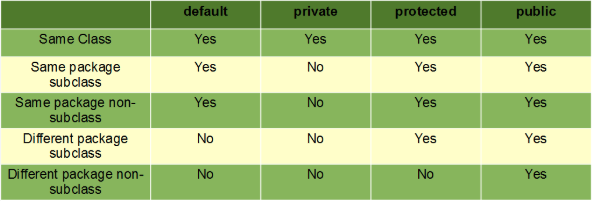

# Java Learning Notes

This file contains the notes when I learned Java in Udemy course. Also, there is some useful concepts, technique related to Java.

Table of contents:

- [Introduction](#Introduction)
- [Data Types](#Data-Types)
- [Statement Control](#Statement-Control)
- [Object Oriented Programming](#Object-Oriented-Programming)
- [Collections](#Collections)

## Introduction

### What is Java ?

Java is one of the most popular and widely used programming language and platform. A platform is an environment that helps to develop and run programs written in any programming language

### Java Environment

- **Java Development Kit (JDK)**: is a software development environment used for developing Java applications and applets. It includes the Java Runtime Environment (JRE), an interpreter/loader (Java), a compiler (javac), an archiver (jar), a documentation generator (Javadoc) and other tools needed in Java development.

- **Java Runtime Environment(JRE)**: JRE may also be written as “Java RTE.” The Java Runtime Environment provides the minimum requirements for executing a Java application; it consists of the Java Virtual Machine (JVM), core classes, and supporting files.

- **Java Virtual machine(JVM)**: is a very important part of both JDK and JRE because it is contained or inbuilt in both. Whatever Java program you run using JRE or JDK goes into JVM and JVM is responsible for executing the java program line by line hence it is also known as interpreter.

### All reserved keyword in Java

```java
abstract     assert     boolean      break      byte     case    catch      char    class

const        continue   default      do         double   else    enum       extends final

finally      float      for          goto       if       implements         import   instanceof

int          interface  long         native     new      package private    protected public

return       short      static       strictfp   super    switch  synchronized   this throw

throws       transient  try          void       volatile while

```

### Keywords

- **final**: final keyword is used in different contexts. First of all, final is a non-access modifier applicable only to a variable, a method or a class.Following are different contexts where final is used. It is good practice to represent final variables in all uppercase, using underscore to separate words.

- **static**: static is a non-access modifier for variable, method, block, nested class. When a member is declared static, it can be accessed before any objects of its class are created, and without reference to any object. Static variables are, essentially, global variables. All instances of the class share the same static variable. Use the static variable for the property that is common to all objects.

## Data Types

### Size of primitive types

- int: A 32-bit (4-byte) integer value
- short: A 16-bit (2-byte) integer value
- long: A 64-bit (8-byte) integer value
- byte: An 8-bit (1-byte) integer value
- float: A 32-bit (4-byte) floating-point value
- double: A 64-bit (8-byte) floating-point value
- char: A 16-bit character using the Unicode encoding scheme
- boolean: A true or false value

### Default values for primitives:

|  Type   | Default Value |
| :-----: | :-----------: |
| boolean |     false     |
|  byte   |       0       |
|  short  |       0       |
|   int   |       0       |
|  long   |      0L       |
|  char   |    \u0000     |
|  float  |     0.0f      |
| double  |     0.0d      |

The limits of primitive types. **Note** Java allows you **overflow**.

```java
public class Main {
  public static void main(String args[]) {

    System.out.println("Min byte value   = " + Byte.MIN_VALUE); // -128
    System.out.println("Max byte value   = " + Byte.MAX_VALUE); // 127
    System.out.println("Min short value  = " + Short.MIN_VALUE); // -32768
    System.out.println("Max short value  = " + Short.MAX_VALUE); // 32767
    System.out.println("Min int value    = " + Integer.MIN_VALUE); // -2147483648
    System.out.println("Max int value    = " + Integer.MAX_VALUE); // 2147483647
    System.out.println("Min long value  = " + Long.MIN_VALUE); // -9223372036854775808
    System.out.println("Max long value  = " + Long.MAX_VALUE); // 9223372036854775807
    System.out.println("Min float value  = " + Float.MIN_VALUE); // 1.4 E-45
    System.out.println("Max float value  = " + Float.MAX_VALUE); // 3.40280235 E38
    System.out.println("Min double value = " + Double.MIN_VALUE); // 4.9 E-324
    System.out.println("Max double value = " + Double.MAX_VALUE); // 1.7976931348623157 E308
  }
}
```

### Conversions

## Statement Control

### If-Else Statement

```java
boolean bool = true;
if (bool) {
    // do something
} else {
    // do other thing
}
```

### Switch Statement

```java
int value = 1;
switch(value) {
  case 1:
    // do something
    break;
  case 2:
    // do something
    break;
  case 3:
    // do something
    break;
  default:
    // do something
    break
}
```

### For-Loop Statement

```java
int n = 10;
for (int i = 0; i < n; i++) {
    // do something
}
```

## Object Oriented Programming

### Class

A class is a blue print from which individual objects are created. A class can contain fields and methods to describe the behavior of an object.

```java
public class Person {
    // write your code here
    private int age;
    private String firstName;
    private String lastName;

    public int getAge() {
        return age;
    }

    public void setAge(int age) {
        this.age = age;
    }

    public String getFirstName() {
        return firstName;
    }

    public void setFirstName(String firstName) {
        this.firstName = firstName;
    }

    public String getLastName() {
        return lastName;
    }

    public void setLastName(String lastName) {
        this.lastName = lastName;
    }
}
```

### Object

Object is a runtime entity and it’s state is stored in fields and behavior is shown via methods.

```java
Person actor = new Person();
Person teacher = new Person();
Person doctor = new Person();
```

### Constructor

Constructor gets invoked when a new object is created. Every class has a constructor. If we do not explicitly write a constructor for a class the java compiler builds a default constructor for that class.

Rules of Construtors:

- Constructor(s) must have the same name as the class within which it defined while it is not necessary for the method in java.
- Constructor(s) do not return any type while method(s) have the return type or void if does not return any value.
- Constructor is called only once at the time of Object creation while method(s) can be called any numbers of time.
- Constructor can be **Overloading**.

```java
public class Person {
    // write your code here
    private int age;
    private String firstName;
    private String lastName;

    // Default Constructor
    Person() {
        System.out.println("Running Default Constructor......")
        this("myFirstName", "myLastName", 0); // set the default value.
    }

    Person(String firstName, String lastName, int age) {
        this.firstName = firstName;
        this.lastName = lastName;
        this.age = age;
    }
}
```

### Access Modifier

As the name suggests access modifiers in Java helps to restrict the scope of a class, constructor , variable , method or data member. There are four types of access modifiers available in java



- **public**: accessible in all class in your application.
- **protected**: accessible within the class in which it is defined and in its subclass(es)
- **private**: accessible only within the class in which it is defined.
- **default** (declared/defined without using any modifier) : accessible within same class and package within which its class is defined

### Inheritance

### Overloading

In many programming languages, it allows user to define method with same function name but different signature. The difference of return type don't change the signature of fuction. It's a ability to create a method with different parameters and improve the readibility and re-usbility of code.

```java
public class Main {
  public static void main(String args[]) {
    sum(1,1); // print 2
    sum(1,2,3) // print 6
    sum() // print There is no input.
  }

  public static int sum(int a, int b) {
    System.out.println(a + b);
    return a + b;
  }

  public static int sum(int a, int b, int c) {
    System.out.println(a + b + c);
    return a + b + c;
  }

  public static int sum() {
    System.out.println("There is no input.");
    return 0;
  }

  // Will raise error, since change return type not chnage signature.
  public static void sum() {
    System.out.println("There is no input.");
    return 0;
  }

```

## References

- [java2s.com](http://www.java2s.com/)
- [java2novice](https://www.java2novice.com/)
